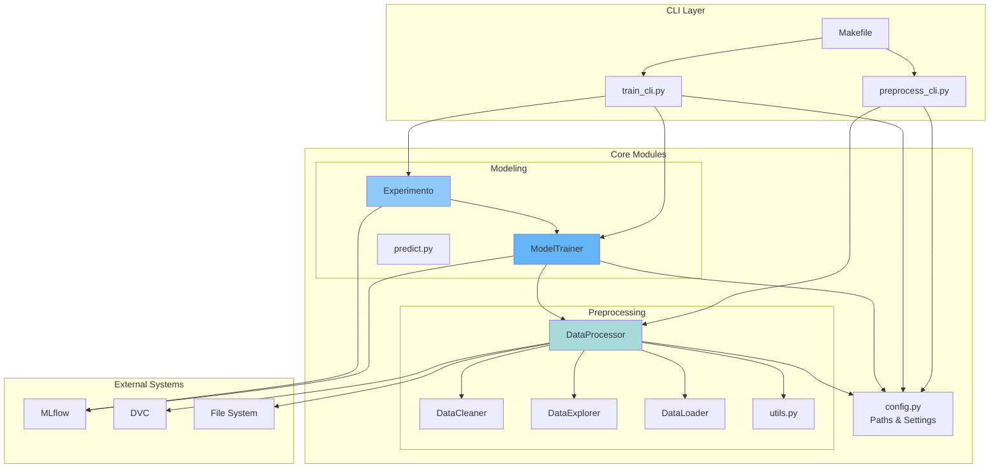
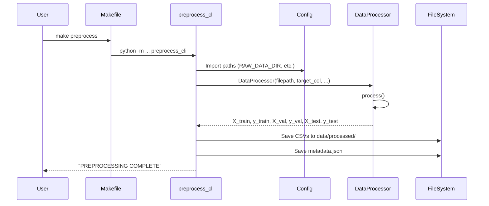
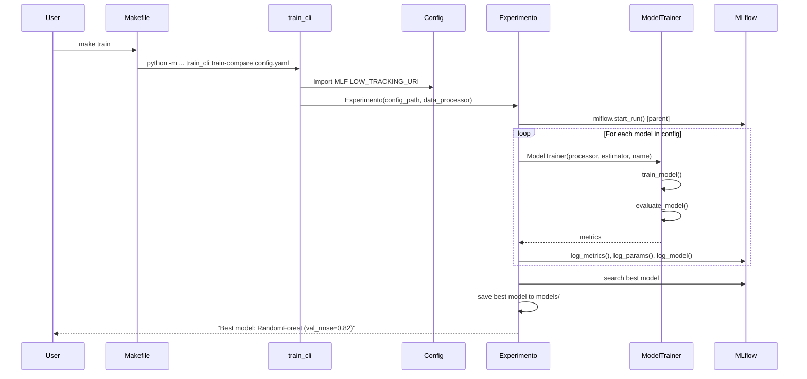

# Component Interactions

This page describes how the different modules and components interact in the MLOps system.

## Component Diagram



## CLI to Core Module Flow

### Preprocessing Flow



### Training Flow



## Module Dependencies

### Dependency Graph

```
config.py (no dependencies)
    ↓
preprocessing/utils.py (no dependencies)
    ↓
preprocessing/data_io.py → config
preprocessing/data_cleaning.py → (pandas, numpy)
preprocessing/data_exploration.py → config
    ↓
preprocessing/data_processor.py → data_cleaning, utils, config
    ↓
modeling/train.py → preprocessing/data_processor, config
    ↓
modeling/compare.py → modeling/train, config
    ↓
cli/preprocess_cli.py → preprocessing/data_processor, config
cli/train_cli.py → modeling/train, modeling/compare, config
```

### Import Patterns

**Good** (follows dependency hierarchy):
```python
# In modeling/train.py
from mlops_online_news_popularity.preprocessing import DataProcessor
from mlops_online_news_popularity.config import MODELS_DIR
```

**Bad** (circular dependency):
```python
# In preprocessing/data_processor.py
from mlops_online_news_popularity.modeling.train import ModelTrainer  # DON'T DO THIS
```

## Communication Patterns

### 1. DataProcessor → ModelTrainer

**What is passed**:
- Train/val/test splits (DataFrames/Series)
- Column classifications (`cols_bin`, `cols_no_bin`)
- Metadata (dropped features, split sizes)

**How**:
```python
# DataProcessor makes data available as attributes
processor = DataProcessor(...)
processor.process()

# ModelTrainer accesses processor's attributes
trainer = ModelTrainer(data_processor=processor, ...)
X_train = processor.X_train
cols_bin = processor.cols_bin
```

### 2. ModelTrainer → MLflow

**What is logged**:
- Parameters (model type, hyperparameters)
- Metrics (RMSE, MAE, R² for train/val/test)
- Artifacts (trained pipeline, model metadata)
- Tags (model name, run type)

**How**:
```python
with mlflow.start_run():
    mlflow.log_param("model_type", "RandomForest")
    mlflow.log_metric("val_rmse", 0.82)
    mlflow.sklearn.log_model(pipeline, "model_pipeline")
```

### 3. Experimento → Multiple ModelTrainers

**Pattern**: Orchestrator

```python
class Experimento:
    def ejecuta_experimentos(self):
        with mlflow.start_run() as parent:  # Parent run
            for model_name, config in self.models.items():
                with mlflow.start_run(nested=True):  # Child run
                    trainer = ModelTrainer(...)
                    trainer.train_model()
                    metrics = trainer.evaluate_model()
                    # Log metrics
```

### 4. CLI → Core Modules

**Pattern**: Facade

CLIs provide simple interfaces to complex operations:

```python
# preprocess_cli.py
@app.command()
def main(input_path, output_dir, ...):
    processor = DataProcessor(...)  # Hide complexity
    processor.process()              # Single method call
    # Save outputs
```

## State Management

### DataProcessor State

**Stateful** - stores intermediate results:

```python
processor = DataProcessor(filepath="...")
processor.process()  # Populates state

# State available after processing
processor.X_train    # DataFrame
processor.y_train    # Series
processor.cols_bin   # List[str]
processor.cols_no_bin  # List[str]
processor.cols_dropped_correlation  # List[str]
```

### ModelTrainer State

**Stateful** - stores model and metrics:

```python
trainer = ModelTrainer(processor, estimator, "MyModel")
trainer.train_model()  # Trains and stores pipeline

# State available after training
trainer.pipeline  # Trained sklearn Pipeline
trainer.baseline_rmse  # Float
trainer.y_train_transformed  # Series (if log transform applied)
```

### Experimento State

**Mostly Stateless** - delegates to ModelTrainer:

```python
experiment = Experimento(config, processor)
experiment.ejecuta_experimentos()  # Trains all models

# Queries MLflow for results (not stored in memory)
best = experiment.mejor_modelo()
```

## Error Handling

### Exception Flow

```python
try:
    processor = DataProcessor(filepath)
    processor.process()
except FileNotFoundError:
    logger.error(f"File not found: {filepath}")
    raise typer.Exit(code=1)
except pd.errors.EmptyDataError:
    logger.error("CSV file is empty")
    raise typer.Exit(code=1)
except Exception as e:
    logger.exception(f"Unexpected error: {e}")
    raise
```

### Logging Strategy

**Using loguru integrated with tqdm**:

```python
from loguru import logger
from tqdm import tqdm

# In config.py: logger configured to use tqdm.write

# In modules
logger.info("Starting preprocessing")
logger.debug(f"Shape: {df.shape}")
logger.warning("High correlation found")
logger.error("Training failed")

# With progress bars
for item in tqdm(items, desc="Processing"):
    logger.info(f"Processing {item}")  # Plays nice with tqdm
```

## Configuration Management

All paths and settings centralized in `config.py`:

```python
# config.py
PROJ_ROOT = Path(__file__).parents[1]
DATA_DIR = PROJ_ROOT / "data"
RAW_DATA_DIR = DATA_DIR / "raw"
PROCESSED_DATA_DIR = DATA_DIR / "processed"
MODELS_DIR = PROJ_ROOT / "models"

MLFLOW_TRACKING_URI = os.getenv("MLFLOW_TRACKING_URI", MLFLOW_DEV_URI)
```

**Usage across modules**:
```python
# Any module can import
from mlops_online_news_popularity.config import RAW_DATA_DIR, MODELS_DIR
```

## Integration Points

### DVC Integration

DataProcessor doesn't directly call DVC, but outputs are DVC-tracked:

```bash
# After preprocessing
dvc add data/processed/
git add data/processed.dvc
```

### MLflow Integration

Direct integration in ModelTrainer and Experimento:

```python
import mlflow
mlflow.set_tracking_uri(MLFLOW_TRACKING_URI)
mlflow.set_experiment("My Experiment")
```

### External Tools

- **pandas-profiling**: Used by DataExplorer for reports
- **scikit-learn**: Used by ModelTrainer for pipelines
- **typer**: Used by CLI modules for argument parsing

## Next Steps

- [Data Flow Details](data-flow.md)
- [Design Patterns](design-patterns.md)
- [ModelTrainer Deep Dive](../modeling/model-trainer.md)
