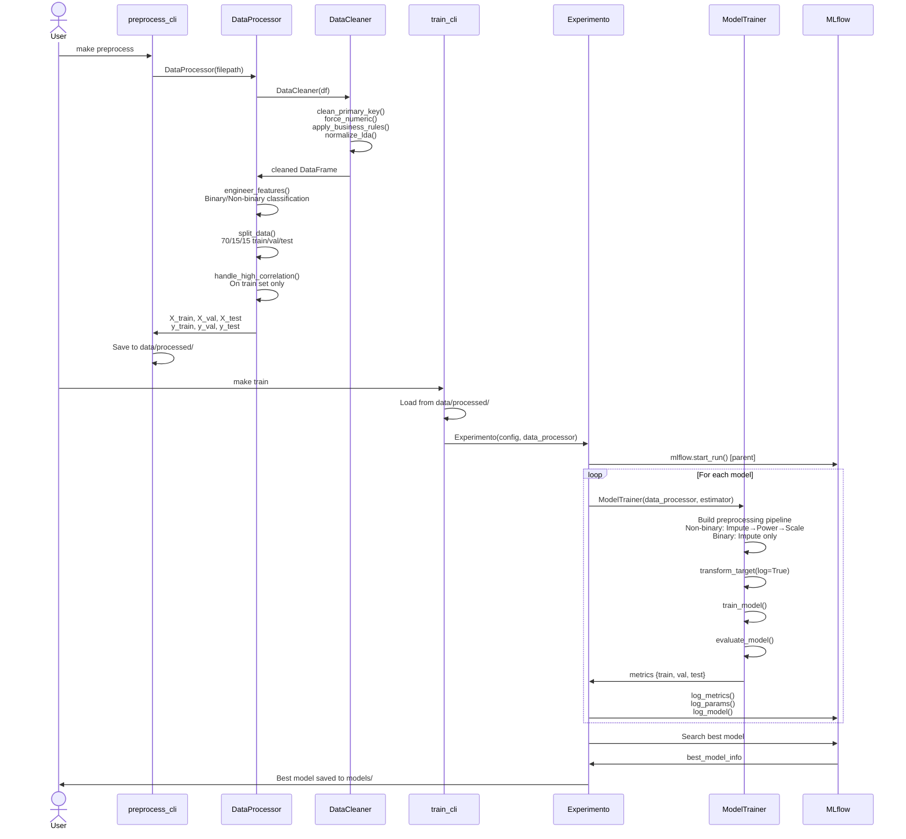

# Data Flow & Pipelines

This page describes how data flows through the MLOps system from raw CSV files to trained models.

## Complete Data Flow



## Pipeline Stages

### Stage 1: Raw Data Ingestion

**Input**: `data/raw/online_news_modified.csv`

**Process**:
```python
from mlops_online_news_popularity.preprocessing import DataLoader

loader = DataLoader()
df = loader.load_csv("data/raw/online_news_modified.csv")
```

**Output**: Raw DataFrame with ~40K rows and 61 columns

---

### Stage 2: Model-Agnostic Preprocessing

**Responsibility**: `DataProcessor`

**Sub-stages**:

#### 2.1 Data Cleaning (`DataCleaner`)

```python
# Executed internally by DataProcessor
cleaner = DataCleaner(df)
cleaned_df = (cleaner
    .clean_primary_key(key="url")
    .force_numeric(exclude=["url"])
    .apply_business_rules()
    .normalize_lda(lda_cols)
    .get_df())
```

**Transformations**:
- URL validation and removal of duplicates
- Convert string numbers to numeric (e.g., "1.5" → 1.5)
- Clip `timedelta` to [0, 731]
- Normalize LDA topic columns to sum to 1

#### 2.2 Feature Engineering

```python
# Separate target from features
X = df.drop(columns=[target_col])
y = df[target_col]

# Drop non-predictive columns
X = X.drop(columns=cols_to_drop)  # ['url', 'timedelta']

# Classify features
from mlops_online_news_popularity.preprocessing.utils import classify_numeric_columns
binary_cols, non_binary_cols = classify_numeric_columns(X)
```

**Output**: Features classified as binary (values in {0, 1}) or non-binary

#### 2.3 Train/Validation/Test Split

```python
# First split: 70% train, 30% temp
X_train, X_temp, y_train, y_temp = train_test_split(
    X, y, test_size=0.3, random_state=42
)

# Second split: 50% val, 50% test (of the 30%)
X_val, X_test, y_val, y_test = train_test_split(
    X_temp, y_temp, test_size=0.5, random_state=42
)
```

**Result**: 70% train / 15% validation / 15% test

#### 2.4 Correlation Handling

!!! danger "Critical: Prevents Data Leakage"
    Correlation is calculated **only** on the training set, then the same features are dropped from validation and test sets.

```python
# Calculate correlation on TRAIN set only
corr_matrix = X_train.corr().abs()

# Find pairs with correlation > threshold (e.g., 0.9)
high_corr_pairs = ...

# Drop feature with higher average correlation
X_train = X_train.drop(columns=cols_to_drop)
X_val = X_val.drop(columns=cols_to_drop)      # Apply to val
X_test = X_test.drop(columns=cols_to_drop)    # Apply to test
```

**Output**:
- `X_train.csv`, `X_val.csv`, `X_test.csv`
- `y_train.csv`, `y_val.csv`, `y_test.csv`
- `metadata.json` (column classifications, dropped features, etc.)

---

### Stage 3: Model-Specific Preprocessing

**Responsibility**: `ModelTrainer`

**Process**: Build scikit-learn `ColumnTransformer` with different strategies for binary and non-binary features

```python
from sklearn.compose import ColumnTransformer
from sklearn.impute import SimpleImputer
from sklearn.preprocessing import PowerTransformer, StandardScaler
from sklearn.pipeline import Pipeline

# Non-binary pipeline: Impute → PowerTransform → Scale
non_binary_pipeline = Pipeline([
    ('impute', SimpleImputer(strategy='median')),
    ('power', PowerTransformer()),
    ('scale', StandardScaler())
])

# Binary pipeline: Impute only (no scaling)
binary_pipeline = Pipeline([
    ('impute', SimpleImputer(strategy='most_frequent'))
])

# Combine both
preprocessor = ColumnTransformer([
    ('non_binary', non_binary_pipeline, non_binary_cols),
    ('binary', binary_pipeline, binary_cols)
])

# Full pipeline: Preprocessing + Model
full_pipeline = Pipeline([
    ('preprocessor', preprocessor),
    ('model', estimator)  # Ridge, RandomForest, etc.
])
```

!!! info "Why This Works"
    The `Pipeline.fit()` method ensures:

    1. Imputers learn statistics from training data only
    2. PowerTransformer learns transformation parameters from training data
    3. StandardScaler learns mean and std from training data
    4. These learned parameters are then applied to validation and test sets

**Output**: sklearn `Pipeline` object ready for training

---

### Stage 4: Model Training

**Responsibility**: `ModelTrainer.train_model()`

```python
# Optional: Transform target
if apply_log:
    y_train_transformed = np.log1p(y_train)
else:
    y_train_transformed = y_train

# Fit the pipeline
pipeline.fit(X_train, y_train_transformed)
```

**What Happens**:
1. `ColumnTransformer` fits imputers, transformers, scalers on X_train
2. `ColumnTransformer` transforms X_train
3. Model (Ridge, RF, etc.) trains on transformed data

**Output**: Trained `Pipeline` object

---

### Stage 5: Model Evaluation

**Responsibility**: `ModelTrainer.evaluate_model()`

```python
# Predict on train/val/test
y_train_pred = pipeline.predict(X_train)
y_val_pred = pipeline.predict(X_val)
y_test_pred = pipeline.predict(X_test)

# If target was log-transformed, reverse it
if apply_log:
    y_train_pred = np.expm1(y_train_pred)
    y_val_pred = np.expm1(y_val_pred)
    y_test_pred = np.expm1(y_test_pred)

# Calculate metrics
train_rmse = mean_squared_error(y_train, y_train_pred, squared=False)
val_rmse = mean_squared_error(y_val, y_val_pred, squared=False)
test_rmse = mean_squared_error(y_test, y_test_pred, squared=False)
```

**Diagnostics**:
- **Underfitting**: `train_rmse > baseline_rmse` (model worse than guessing the mean)
- **Overfitting**: `train_rmse << val_rmse` (large gap between train and validation)
- **Good fit**: `train_rmse ≈ val_rmse` and both better than baseline

**Output**: Dictionary of metrics for train/val/test sets

---

### Stage 6: Experiment Tracking with MLflow

**Responsibility**: `Experimento`

**Process**:

```python
# Start parent run
with mlflow.start_run(run_name=f"comparison_{timestamp}") as parent_run:
    mlflow.set_tag("run_type", "parent")
    mlflow.log_param("num_models", len(models_to_try))

    # For each model in config
    for model_name, model_config in models_to_try.items():
        # Start child run
        with mlflow.start_run(run_name=model_name, nested=True) as child_run:
            mlflow.set_tag("run_type", "child")

            # Train model
            trainer = ModelTrainer(processor, estimator, model_name)
            trainer.train_model()
            metrics = trainer.evaluate_model()

            # Log to MLflow
            mlflow.log_metrics({
                "train_rmse": metrics["train"]["rmse"],
                "val_rmse": metrics["val"]["rmse"],
                "test_rmse": metrics["test"]["rmse"],
                # ... more metrics
            })

            # Save model artifact
            mlflow.sklearn.log_model(trainer.pipeline, "model_pipeline")
```

**MLflow Hierarchy**:
```
Experiment: "Impacto de Publicacion"
└── Parent Run: "comparison_20241101_153045"
    ├── Child Run 1: "Ridge"
    ├── Child Run 2: "RandomForest"
    └── Child Run 3: "KNeighbors"
```

---

### Stage 7: Best Model Selection

**Responsibility**: `Experimento.mejor_modelo()`

```python
# Search for best model based on metric
runs = mlflow.search_runs(experiment_ids=[exp_id])

# Filter child runs only
child_runs = runs[runs["tags.run_type"] == "child"]

# Order by metric (ascending for RMSE, descending for R²)
if optimize_mode == "ASC":
    best_run = child_runs.sort_values(f"metrics.{metric}").iloc[0]
else:
    best_run = child_runs.sort_values(f"metrics.{metric}", ascending=False).iloc[0]

# Save best model
model_uri = f"runs:/{best_run.run_id}/model_pipeline"
model = mlflow.sklearn.load_model(model_uri)
joblib.dump(model, f"models/{model_name}_best_{timestamp}.pkl")
```

**Output**: Best model saved to `models/` directory

---

## Data Versioning with DVC

DVC tracks data changes alongside code changes:

```bash
# Track raw data
dvc add data/raw/online_news_modified.csv

# Track processed data
dvc add data/processed/

# Commit DVC files to git
git add data/raw/.gitignore data/raw/online_news_modified.csv.dvc
git commit -m "Add raw data"
```

**Benefits**:
- Data versions linked to code versions
- Reproducible experiments
- Efficient storage (only stores diffs)

---

## Artifact Storage

### Local Artifacts

```
mlops-project/
├── data/
│   ├── raw/                    # DVC tracked
│   └── processed/              # DVC tracked
├── models/
│   └── ridge_best_*.pkl        # Best models
└── mlflow/
    └── dev/
        ├── mlflow.db           # Experiment metadata
        └── mlruns/             # Model artifacts
            └── {run_id}/
                └── artifacts/
                    └── model_pipeline/
```

### MLflow Artifacts per Run

Each MLflow run stores:
- `model_pipeline/`: Serialized sklearn Pipeline
- `params.json`: Hyperparameters
- `metrics.json`: Performance metrics
- `tags.json`: Metadata tags

---

## Data Flow Guarantees

### No Data Leakage

✅ **Correlation handling**: Calculated on train set only
✅ **Imputation**: Learned from train set, applied to val/test
✅ **Scaling**: Mean/std from train set, applied to val/test
✅ **Power transform**: Parameters from train set, applied to val/test

### Reproducibility

✅ **Random seeds**: Set to 42 for all splits and models
✅ **DVC tracking**: Data versions linked to code versions
✅ **MLflow logging**: All parameters and metrics recorded
✅ **Pipeline serialization**: Entire transformation chain saved

---

## Next Steps

- [Component Interactions](components.md) - How modules communicate
- [DataProcessor Details](../preprocessing/data-processor.md) - Deep dive into preprocessing
- [ModelTrainer Details](../modeling/model-trainer.md) - Deep dive into training
