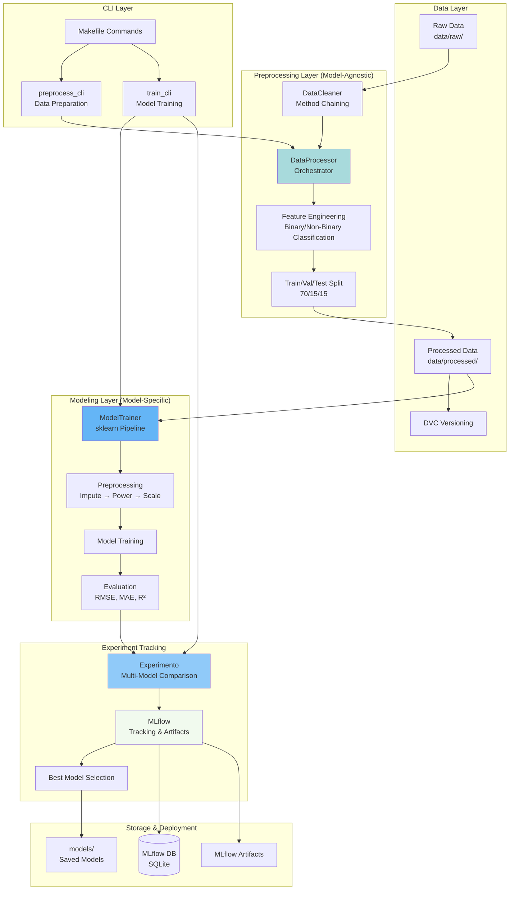

# System Architecture Overview

This page provides a comprehensive overview of the MLOps Online News Popularity prediction system architecture.

## Architectural Principles

The system is built on several key architectural principles:

### 1. Separation of Concerns

The architecture clearly separates **model-agnostic** preprocessing from **model-specific** transformations:

- **Model-Agnostic (`DataProcessor`)**: Operations that apply regardless of which ML model you use
  - Data cleaning and validation
  - Feature engineering
  - Train/validation/test splitting
  - Correlation-based feature selection

- **Model-Specific (`ModelTrainer`)**: Operations that depend on the chosen model
  - Missing value imputation strategies
  - Feature scaling and normalization
  - Power transformations for skewed distributions
  - Model training and hyperparameter tuning

!!! info "Why This Matters"
    This separation prevents data leakage and makes the code maintainable. You can change models without touching preprocessing, and vice versa.

### 2. Composition Over Inheritance

The system uses composition rather than deep inheritance hierarchies:

- `DataProcessor` *uses* `DataCleaner` (composition)
- `ModelTrainer` *uses* `DataProcessor`'s output (composition)
- `Experimento` orchestrates multiple `ModelTrainer` instances (composition)

### 3. Pipeline-Based Approach

All transformations use scikit-learn's `Pipeline` to ensure:

- Transformations fitted only on training data
- Same transformations applied to validation and test sets
- Reproducibility and deployment readiness

## High-Level Architecture



## Technology Stack

### Core Framework
- **Python 3.10**: Programming language
- **scikit-learn**: ML framework with Pipeline support
- **pandas & numpy**: Data manipulation

### MLOps Tools
- **MLflow**: Experiment tracking, model versioning, artifact storage
- **DVC**: Data versioning and pipeline management
- **Git**: Code versioning

### Development Tools
- **typer**: CLI framework for command-line interfaces
- **loguru**: Advanced logging with tqdm integration
- **pytest**: Testing framework
- **black, isort, flake8**: Code formatting and linting

### Documentation
- **MkDocs Material**: Documentation site generator
- **pandas-profiling**: Automated data profiling reports

## Module Structure

```
mlops_online_news_popularity/
├── config.py                   # Centralized configuration
├── preprocessing/              # Model-agnostic preprocessing
│   ├── data_processor.py       # Main orchestrator
│   ├── data_cleaning.py        # Cleaning utilities
│   ├── data_exploration.py     # EDA and profiling
│   ├── data_io.py              # CSV I/O operations
│   ├── data_comparison.py      # Dataset comparison
│   └── utils.py                # Helper functions
├── modeling/                   # Model-specific operations
│   ├── train.py                # ModelTrainer class
│   ├── compare.py              # Experimento class
│   └── predict.py              # Inference
└── cli/                        # Command-line interfaces
    ├── preprocess_cli.py       # Preprocessing CLI
    └── train_cli.py            # Training CLI
```

## Design Patterns Used

### 1. Builder Pattern
The `DataCleaner` class uses method chaining to build a cleaning pipeline:

```python
cleaner = DataCleaner(df)
cleaned_df = (cleaner
    .clean_primary_key(key="url")
    .force_numeric(exclude=["url"])
    .apply_business_rules()
    .normalize_lda(["LDA_00", "LDA_01", "LDA_02", "LDA_03", "LDA_04"])
    .get_df())
```

### 2. Strategy Pattern
`ModelTrainer` accepts any scikit-learn estimator, allowing different strategies:

```python
# Strategy 1: Ridge Regression
trainer = ModelTrainer(processor, Ridge(), "Ridge")

# Strategy 2: Random Forest
trainer = ModelTrainer(processor, RandomForestRegressor(), "RF")
```

### 3. Template Method Pattern
`DataProcessor.process()` defines the algorithm structure, with customizable steps:

```python
def process(self):
    self.load_and_clean()      # Step 1 (can be customized)
    self.engineer_features()   # Step 2 (can be customized)
    self.split_data()          # Step 3 (fixed)
    self._handle_high_correlation()  # Step 4 (can be customized)
    return self
```

### 4. Facade Pattern
The CLI modules (`preprocess_cli`, `train_cli`) provide simple interfaces to complex subsystems.

## Key Design Decisions

### Why Separate Model-Agnostic from Model-Specific?

**Problem**: Traditional ML pipelines often mix all preprocessing steps together, leading to:
- Data leakage when scaling/imputing before splitting
- Tight coupling between preprocessing and model choice
- Difficult to swap models without rewriting preprocessing

**Solution**: Clear separation ensures:
- ✅ No data leakage (train-only transformations in `ModelTrainer`)
- ✅ Reusable preprocessing for any model
- ✅ Easier experimentation with different models

### Why Use scikit-learn Pipeline?

**Benefits**:
- Prevents data leakage by fitting only on training data
- Makes deployment simple (one object contains everything)
- Enables easy cross-validation without leakage
- Reproducible transformations

### Why MLflow for Experiment Tracking?

**Advantages over alternatives** (W&B, Neptune, TensorBoard):
- Lightweight (local SQLite database)
- No external dependencies or accounts required
- Built-in model registry
- Easy artifact storage
- Parent-child run hierarchy for comparing multiple models

## Data Flow Summary

1. **Raw Data** → `DataCleaner` → Clean DataFrame
2. **Clean DataFrame** → `DataProcessor` → Train/Val/Test Splits
3. **Splits** → `ModelTrainer` → sklearn Pipeline → Trained Model
4. **Trained Model** → `Experimento` → MLflow → Best Model Selection
5. **Best Model** → `models/` directory for deployment

## Next Steps

- [Data Flow Details](data-flow.md) - Detailed sequence diagrams
- [Component Interactions](components.md) - How modules communicate
- [Design Patterns](design-patterns.md) - In-depth pattern explanations
