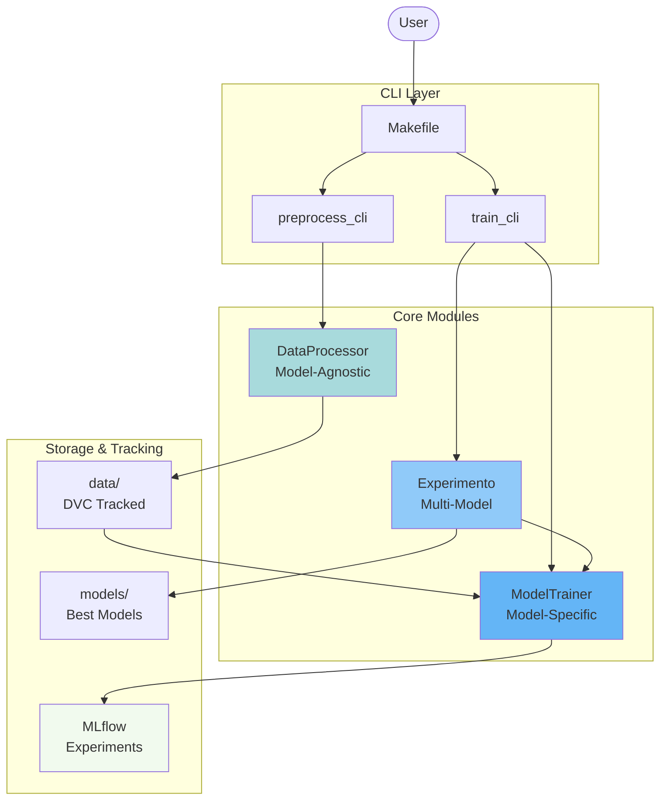

# mlops_online_news_popularity

MLOps project for predicting Online News Popularity using machine learning

## Overview

This project implements a complete MLOps pipeline for predicting the popularity (shares) of online news articles. It follows best practices for reproducible machine learning with:

- **Automated preprocessing pipeline** with data cleaning, feature engineering, and train/val/test splitting
- **MLflow experiment tracking** for comparing multiple models
- **DVC data versioning** for managing datasets
- **Modular architecture** with separation between model-agnostic and model-specific transformations
- **CLI interfaces** for all major operations

## Key Features

### Data Preprocessing
- Comprehensive data cleaning (URL validation, numeric conversion, business rules)
- Feature engineering and correlation analysis
- Automated train/validation/test splitting (70/15/15)
- Data profiling reports with pandas-profiling

### Model Training
- Multiple model support (Ridge, RandomForest, KNeighbors, XGBoost, etc.)
- Automated hyperparameter configuration via YAML
- scikit-learn Pipeline integration for proper train/test separation
- Comprehensive evaluation metrics (RMSE, MAE, R²)
- Overfitting/underfitting diagnostics

### MLflow Integration
- Experiment tracking with two environments (dev and quickstart)
- Automatic metric logging (train/val/test RMSE, MAE, R²)
- Model artifact versioning
- Parameter tracking
- Web UI for experiment comparison

### Code Quality
- Black + isort code formatting (line length: 99)
- Flake8 linting
- pytest testing framework
- Type hints and comprehensive documentation

## System Architecture



!!! tip "Learn More"
    See [Architecture Overview](architecture/overview.md) for detailed architectural diagrams and design patterns.

## Project Structure

```
mlops-project/
├── config/               # Model configurations (YAML)
├── data/                 # Data directory (DVC managed)
│   ├── raw/             # Original immutable data
│   └── processed/       # Train/val/test splits
├── mlflow/              # MLflow tracking databases
│   ├── dev/            # Development experiments
│   └── quickstart/     # Learning/tutorial experiments
├── models/              # Saved model artifacts
├── mlops_online_news_popularity/  # Main package
│   ├── cli/            # Command-line interfaces
│   ├── preprocessing/  # Data processing modules
│   └── modeling/       # Training and inference
├── notebooks/           # Jupyter notebooks
├── tests/              # Unit tests
└── docs/               # Documentation + profiling reports
```

## Quick Start

Get up and running in 5 minutes:

```bash
# 1. Install dependencies
pip install -e .
pip install -r requirements.txt

# 2. Run complete pipeline
make pipeline

# 3. View results
make mlflow-ui
```

See [Quick Start Guide](workflows/quick-start.md) for detailed instructions.

## Documentation Sections

### 📚 Getting Started
- [Installation & Setup](getting-started.md) - Complete setup guide
- [Quick Start](workflows/quick-start.md) - 5-minute tutorial
- [Troubleshooting](troubleshooting.md) - Common issues and solutions

### 🏗️ Architecture
- [Overview](architecture/overview.md) - System architecture and design principles
- [Data Flow](architecture/data-flow.md) - End-to-end data flow diagrams
- [Components](architecture/components.md) - Module interactions
- [Design Patterns](architecture/design-patterns.md) - Patterns used in the project

### 🔧 Preprocessing
- [Overview](preprocessing/overview.md) - Model-agnostic vs model-specific
- [DataProcessor](preprocessing/data-processor.md) - Main preprocessing class
- [DataCleaner](preprocessing/data-cleaner.md) - Method chaining for cleaning
- [Utilities](preprocessing/utilities.md) - Helper classes

### 🤖 Modeling
- [ModelTrainer](modeling/model-trainer.md) - Model training with sklearn Pipeline
- [Experiment Tracking](modeling/experiment-tracking.md) - MLflow integration
- [Model Selection](modeling/model-selection.md) - Best model selection

### 💻 CLI Reference
- [Commands Overview](cli/commands.md) - All available commands
- [Preprocessing CLI](cli/preprocess-cli.md) - Data preprocessing command
- [Training CLI](cli/train-cli.md) - Model training commands

### 🔄 Workflows
- [Complete Pipeline](workflows/complete-pipeline.md) - End-to-end workflow
- [Development Workflow](workflows/development.md) - Iterative development
- [Experiment Workflow](workflows/experiments.md) - Running experiments
- [DVC Data Versioning](workflows/dvc.md) - Data versioning workflow

### ⚙️ Configuration
- [Path Management](configuration/paths.md) - Centralized paths
- [Models YAML](configuration/models-yaml.md) - Model configuration
- [Environment Variables](configuration/environment.md) - Environment config

### 📖 API Reference
- [Preprocessing API](api-reference/preprocessing.md) - Complete API docs
- [Modeling API](api-reference/modeling.md) - Model training API
- [CLI API](api-reference/cli.md) - Command-line interface API

### ✅ Best Practices
- [Preventing Data Leakage](best-practices/data-leakage.md) - Critical practices
- [Code Quality](best-practices/code-quality.md) - Standards and tools
- [Testing](best-practices/testing.md) - Testing guidelines

### 📊 Data Profiling
- [Data Profiling Reports](data-profiling.md) - Automated profiling reports

### 🤝 Contributing
- [Contributing Guide](contributing.md) - How to contribute
- [Changelog](changelog.md) - Version history

