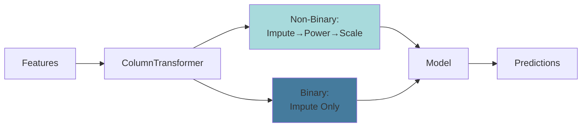

# ModelTrainer Class

Handles model-specific preprocessing and training with sklearn Pipeline.

## Purpose

`ModelTrainer` builds preprocessing pipelines tailored to specific models and handles training/evaluation.

## Basic Usage

```python
from mlops_online_news_popularity.modeling.train import ModelTrainer
from sklearn.ensemble import RandomForestRegressor

trainer = ModelTrainer(
    data_processor=processor,
    estimator=RandomForestRegressor(n_estimators=100, random_state=42),
    model_name="Random Forest"
)

# Optional: Transform target
trainer.transform_target(apply_log=True)

# Train
trainer.train_model()

# Evaluate
metrics = trainer.evaluate_model()

# Cross-validate
cv_results = trainer.cross_validate_model(cv=5)
```

## Pipeline Architecture



## Key Methods

- `transform_target()`: Apply log transformation to target
- `train_model()`: Fit the sklearn Pipeline
- `evaluate_model()`: Calculate metrics on train/val/test
- `cross_validate_model()`: K-fold cross-validation

See [API Reference](../api-reference/modeling.md) for details.
