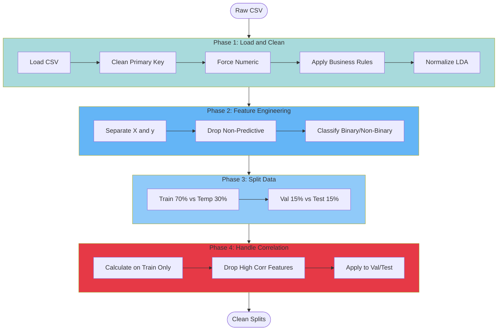

# Preprocessing Overview

## Model-Agnostic vs Model-Specific

The preprocessing architecture separates concerns into two clear phases:

### Model-Agnostic Preprocessing (DataProcessor)

Operations that apply regardless of which ML model you use:

- ✅ Data cleaning and validation
- ✅ Feature engineering
- ✅ Train/validation/test splitting (70/15/15)
- ✅ Correlation-based feature selection

**Why Model-Agnostic?**
- Same preprocessing for Ridge, RandomForest, XGBoost, etc.
- No assumptions about model requirements
- Prevents tight coupling between data and models

### Model-Specific Preprocessing (ModelTrainer)

Operations that depend on the chosen model:

- ✅ Missing value imputation (median vs mode)
- ✅ Feature scaling (StandardScaler)
- ✅ Power transformations (handle skewness)
- ✅ Target transformation (log for skewed targets)

**Why Model-Specific?**
- Different models have different requirements
- Linear models need scaling, tree models don't
- Transformations must be fitted only on training data

## Preprocessing Flow Diagram



## Data Leakage Prevention

!!! danger "Critical"
    All statistics (correlation, mean, std) are calculated **only** on the training set, then applied to validation and test sets.

**Example**:
```python
# CORRECT: Fit on train only
corr_matrix = X_train.corr()
high_corr_cols = find_high_corr(corr_matrix, threshold=0.9)

# Apply to all splits
X_train = X_train.drop(columns=high_corr_cols)
X_val = X_val.drop(columns=high_corr_cols)
X_test = X_test.drop(columns=high_corr_cols)

# WRONG: Fit on all data
corr_matrix = pd.concat([X_train, X_val, X_test]).corr()  # DATA LEAKAGE!
```

## Key Classes

- **[DataProcessor](data-processor.md)**: Main orchestrator for preprocessing pipeline
- **[DataCleaner](data-cleaner.md)**: Method chaining for data cleaning
- **[Utilities](utilities.md)**: Helper classes (DataExplorer, DataLoader, etc.)

## Next Steps

- [DataProcessor Details](data-processor.md)
- [Data Flow](../architecture/data-flow.md)
- [Model Training](../modeling/model-trainer.md)
