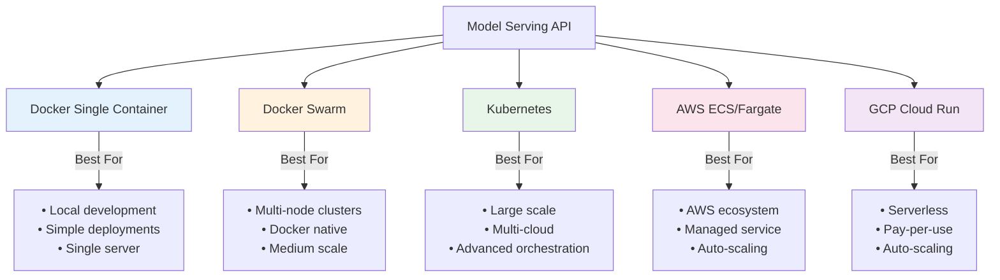
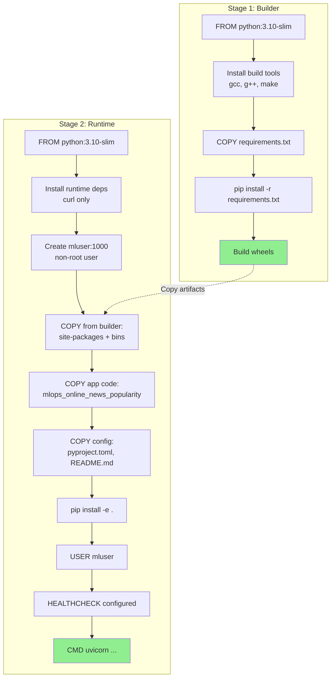
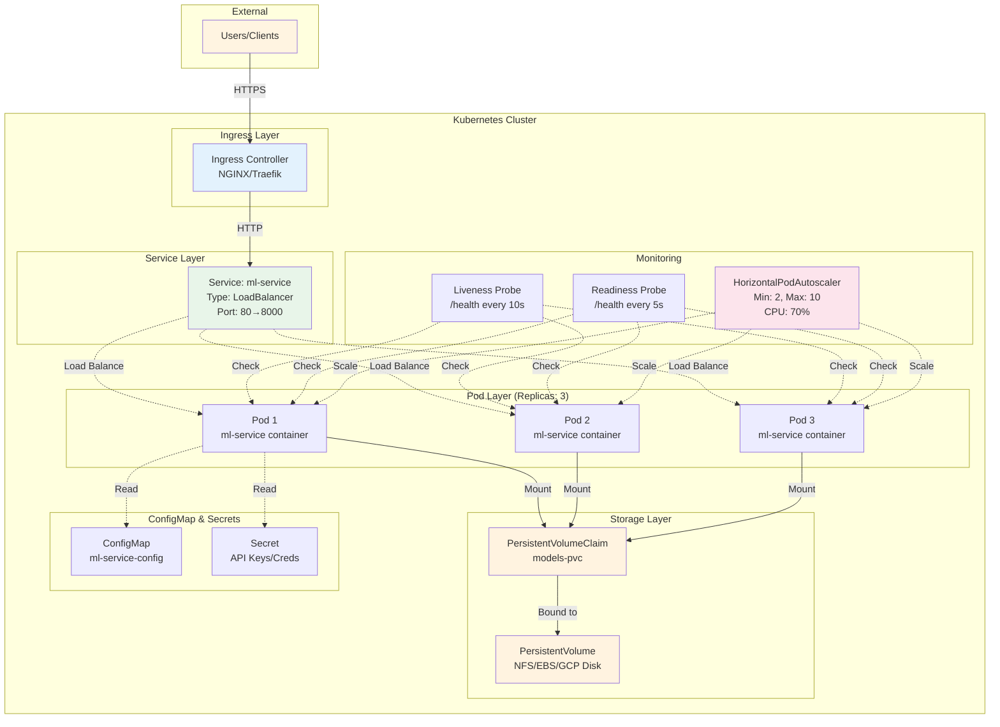

# Deployment Guide

This guide covers deploying the model serving API in various environments, from local Docker to cloud platforms.

## Deployment Options Overview



### Deployment Comparison Table

| Feature | Docker | Docker Swarm | Kubernetes | AWS ECS | GCP Cloud Run |
|---------|--------|--------------|------------|---------|---------------|
| **Complexity** | Low | Medium | High | Medium | Low |
| **Setup Time** | Minutes | 30 mins | Hours | 30 mins | Minutes |
| **Scaling** | Manual | Auto | Auto | Auto | Auto |
| **Cost** | Low | Medium | High | Medium | Pay-per-use |
| **Maintenance** | Low | Medium | High | Low | Very Low |
| **Best For** | Dev/Test | Small Prod | Enterprise | AWS Users | Serverless |

## Docker Deployment

### Quick Start with Docker

```bash
# Build the image
make docker-build

# Run the container
make docker-run

# Or use docker-compose
make docker-up
```

### Manual Docker Commands

#### Build

```bash
docker build -t ml-service:latest .
```

The build process:
- Uses multi-stage build for smaller image size
- Base image: `python:3.10-slim`
- Final size: ~300MB (including RandomForest model)
- Non-root user for security
- Health check included

#### Docker Container Architecture

```mermaid
graph TB
    subgraph "Docker Host"
        subgraph "Container: online-news-predictor"
            subgraph "Application Layer (mluser:1000)"
                UVICORN[Uvicorn Server<br/>Port 8000<br/>Workers: 1]
                FASTAPI[FastAPI Application]
                MODEL_H[ModelHandler<br/>Singleton]
            end

            subgraph "Volume Mounts (Read-Only)"
                VOL_MODELS[/app/models<br/>→ host/models]
                VOL_MLF[/app/mlflow_artifacts<br/>→ host/mlflow_artifacts]
            end

            subgraph "Logging"
                VOL_LOGS[/app/logs<br/>→ host/logs]
                LOGURU[Loguru Logger<br/>stderr]
            end

            subgraph "Health Check"
                HEALTH_CMD[curl -f<br/>http://localhost:8000/health]
                HEALTH_INT[Interval: 30s<br/>Timeout: 10s<br/>Retries: 3]
            end

            UVICORN --> FASTAPI
            FASTAPI --> MODEL_H
            MODEL_H -.->|Read Model| VOL_MODELS
            MODEL_H -.->|Read Artifacts| VOL_MLF
            FASTAPI --> LOGURU
            LOGURU --> VOL_LOGS
            HEALTH_CMD --> FASTAPI
        end

        PORT[Port Mapping<br/>Host:8000 → Container:8000]
        NETWORK[Bridge Network<br/>ml-network]
    end

    CLIENT[External Client] -->|HTTP Request| PORT
    PORT --> UVICORN

    HEALTH_INT -.->|Check| HEALTH_CMD

    style VOL_MODELS fill:#e1f5e1
    style VOL_MLF fill:#e1f5e1
    style VOL_LOGS fill:#ffe1e1
    style HEALTH_CMD fill:#e1e5ff
    style CLIENT fill:#fff4e1
```

#### Multi-Stage Build Process



#### Run

```bash
docker run -d \
  --name online-news-predictor \
  -p 8000:8000 \
  -v $(pwd)/models:/app/models:ro \
  -v $(pwd)/mlflow_artifacts:/app/mlflow_artifacts:ro \
  -e MODEL_NAME=RandomForestBase \
  -e MODEL_LOAD_STRATEGY=local \
  -e MODEL_PATH=/app/models/randomforestbase_best_20251102_165526.pkl \
  ml-service:latest
```

**Volume Mounts Explanation**:
- `-v $(pwd)/models:/app/models:ro` - Mount models directory (read-only)
- `-v $(pwd)/mlflow_artifacts:/app/mlflow_artifacts:ro` - Mount MLflow artifacts

**Why Volume Mounts?**
- Update models without rebuilding the image
- Smaller image size
- Share models across multiple containers

#### View Logs

```bash
docker logs -f online-news-predictor
```

#### Stop Container

```bash
docker stop online-news-predictor
docker rm online-news-predictor
```

### Docker Compose

**Recommended for local development and testing.**

`docker-compose.yml` includes:
- Automatic volume mounts
- Environment variable configuration
- Health checks
- Restart policies
- Network configuration

```bash
# Start services
docker-compose up -d

# View logs
docker-compose logs -f

# Stop services
docker-compose down

# Rebuild and restart
docker-compose up -d --build
```

## Publishing to Docker Registry

### Docker Hub

```bash
# 1. Tag the image
docker tag ml-service:latest your-username/ml-service:latest
docker tag ml-service:latest your-username/ml-service:v1.0.0

# 2. Login to Docker Hub
docker login

# 3. Push images
docker push your-username/ml-service:latest
docker push your-username/ml-service:v1.0.0

# 4. Pull and run from registry
docker pull your-username/ml-service:latest
docker run -p 8000:8000 \
  -v $(pwd)/models:/app/models \
  your-username/ml-service:latest
```

### Private Registry

```bash
# Tag for private registry
docker tag ml-service:latest registry.example.com/ml-service:latest

# Login to private registry
docker login registry.example.com

# Push
docker push registry.example.com/ml-service:latest
```

## Production Deployment Options

### Option 1: Single Server (VPS/EC2)

**Best for**: Small to medium workloads, MVP deployments

```bash
# On the server
git clone <repository-url>
cd mlops-project

# Build and run
make docker-build
make docker-up

# Set up systemd service for auto-start
sudo systemctl enable docker
```

**Pros**:
- Simple setup
- Low cost
- Easy to debug

**Cons**:
- No automatic scaling
- Single point of failure
- Manual updates

### Option 2: Docker Swarm

**Best for**: Multi-server setups without Kubernetes complexity

```bash
# Initialize swarm
docker swarm init

# Create service
docker service create \
  --name ml-service \
  --replicas 3 \
  --publish 8000:8000 \
  --mount type=bind,source=$(pwd)/models,target=/app/models,readonly \
  ml-service:latest

# Scale service
docker service scale ml-service=5

# Update service (rolling update)
docker service update --image ml-service:v2.0.0 ml-service
```

**Pros**:
- Built-in load balancing
- Auto-restart on failure
- Rolling updates
- Simple orchestration

**Cons**:
- Less features than Kubernetes
- Smaller ecosystem

### Option 3: Kubernetes

**Best for**: Large-scale, enterprise deployments

#### Kubernetes Architecture



#### Kubernetes Deployment YAML

```yaml
# deployment.yaml
apiVersion: apps/v1
kind: Deployment
metadata:
  name: ml-service
spec:
  replicas: 3
  selector:
    matchLabels:
      app: ml-service
  template:
    metadata:
      labels:
        app: ml-service
    spec:
      containers:
      - name: ml-service
        image: your-username/ml-service:latest
        ports:
        - containerPort: 8000
        env:
        - name: MODEL_NAME
          value: "RandomForestBase"
        - name: MODEL_LOAD_STRATEGY
          value: "local"
        volumeMounts:
        - name: models
          mountPath: /app/models
          readOnly: true
        livenessProbe:
          httpGet:
            path: /health
            port: 8000
          initialDelaySeconds: 30
          periodSeconds: 10
        readinessProbe:
          httpGet:
            path: /health
            port: 8000
          initialDelaySeconds: 10
          periodSeconds: 5
        resources:
          requests:
            memory: "512Mi"
            cpu: "250m"
          limits:
            memory: "2Gi"
            cpu: "1000m"
      volumes:
      - name: models
        persistentVolumeClaim:
          claimName: models-pvc
---
apiVersion: v1
kind: Service
metadata:
  name: ml-service
spec:
  selector:
    app: ml-service
  ports:
  - protocol: TCP
    port: 80
    targetPort: 8000
  type: LoadBalancer
```

Deploy:

```bash
kubectl apply -f deployment.yaml
```

**Pros**:
- Auto-scaling (HPA)
- Self-healing
- Rolling updates
- Service discovery
- Load balancing

**Cons**:
- Complex setup
- Steeper learning curve
- Higher operational overhead

### Option 4: AWS ECS/Fargate

**Best for**: AWS-native deployments, serverless containers

```bash
# Create ECR repository
aws ecr create-repository --repository-name ml-service

# Login to ECR
aws ecr get-login-password --region us-east-1 | \
  docker login --username AWS --password-stdin <account-id>.dkr.ecr.us-east-1.amazonaws.com

# Tag and push
docker tag ml-service:latest <account-id>.dkr.ecr.us-east-1.amazonaws.com/ml-service:latest
docker push <account-id>.dkr.ecr.us-east-1.amazonaws.com/ml-service:latest

# Create ECS task definition and service (via AWS Console or CLI)
```

**Pros**:
- Serverless (Fargate)
- Integrated with AWS services
- Auto-scaling
- Pay-per-use

**Cons**:
- AWS-specific
- Can be expensive at scale
- Vendor lock-in

### Option 5: Google Cloud Run

**Best for**: Fully managed, auto-scaling, pay-per-use

```bash
# Build and push to GCR
gcloud builds submit --tag gcr.io/PROJECT-ID/ml-service

# Deploy to Cloud Run
gcloud run deploy ml-service \
  --image gcr.io/PROJECT-ID/ml-service \
  --platform managed \
  --region us-central1 \
  --allow-unauthenticated \
  --memory 2Gi \
  --cpu 2 \
  --max-instances 10
```

**Pros**:
- Fully managed
- Auto-scaling (including to zero)
- Pay only for requests
- Simple deployment

**Cons**:
- Stateless only
- Request timeout limits
- Vendor lock-in

## Production Considerations

### 1. Environment Configuration

Use environment variables or secrets management:

```bash
# Docker secrets
echo "your-mlflow-uri" | docker secret create mlflow_uri -

# Kubernetes secrets
kubectl create secret generic ml-service-secrets \
  --from-literal=mlflow-run-id=abc123 \
  --from-literal=api-key=secret
```

### 2. Monitoring & Logging

**Application Logs**:
```python
# Already integrated via loguru
# Set LOG_LEVEL=INFO in production
```

**Container Logs**:
```bash
# Docker
docker logs -f online-news-predictor

# Kubernetes
kubectl logs -f deployment/ml-service
```

**Monitoring Tools**:
- Prometheus + Grafana
- Datadog
- New Relic
- AWS CloudWatch

### 3. Performance Tuning

**Gunicorn with Multiple Workers** (alternative to uvicorn):

```dockerfile
# In Dockerfile, replace CMD with:
CMD ["gunicorn", "mlops_online_news_popularity.serving.app:app", \
     "--workers", "4", \
     "--worker-class", "uvicorn.workers.UvicornWorker", \
     "--bind", "0.0.0.0:8000"]
```

**Resource Limits**:
- Memory: 512MB minimum, 2GB recommended
- CPU: 0.25 cores minimum, 1 core recommended
- Adjust based on model size and request volume

### 4. Load Balancing

**Nginx** (in front of Docker containers):

```nginx
upstream ml_service {
    server localhost:8001;
    server localhost:8002;
    server localhost:8003;
}

server {
    listen 80;
    location / {
        proxy_pass http://ml_service;
        proxy_set_header Host $host;
        proxy_set_header X-Real-IP $remote_addr;
    }
}
```

### 5. SSL/TLS

Use a reverse proxy (Nginx, Traefik) or cloud load balancer with SSL certificate:

```bash
# Let's Encrypt with Certbot
certbot --nginx -d api.yourdomain.com
```

### 6. Rate Limiting

Implement at the API Gateway or reverse proxy level:

```nginx
# Nginx rate limiting
limit_req_zone $binary_remote_addr zone=api_limit:10m rate=10r/s;

location / {
    limit_req zone=api_limit burst=20;
    proxy_pass http://ml_service;
}
```

### 7. Model Updates

**Zero-Downtime Updates**:

1. **Update model file** in mounted volume
2. **Update environment variable** with new model path
3. **Rolling restart** containers

```bash
# Kubernetes rolling update
kubectl set env deployment/ml-service MODEL_PATH=/app/models/new_model.pkl
kubectl rollout status deployment/ml-service

# Docker Swarm
docker service update --env-add MODEL_PATH=/app/models/new_model.pkl ml-service
```

## CI/CD Integration

### GitHub Actions Example

```yaml
name: Deploy ML Service

on:
  push:
    branches: [main]

jobs:
  build-and-deploy:
    runs-on: ubuntu-latest
    steps:
      - uses: actions/checkout@v3

      - name: Build Docker image
        run: docker build -t ml-service:${{ github.sha }} .

      - name: Run tests
        run: |
          docker run ml-service:${{ github.sha }} pytest tests/

      - name: Push to registry
        run: |
          echo "${{ secrets.DOCKER_PASSWORD }}" | docker login -u "${{ secrets.DOCKER_USERNAME }}" --password-stdin
          docker tag ml-service:${{ github.sha }} your-username/ml-service:latest
          docker push your-username/ml-service:latest

      - name: Deploy to production
        run: |
          # Deploy to your platform (K8s, ECS, etc.)
          kubectl set image deployment/ml-service ml-service=your-username/ml-service:latest
```

## Health Checks

The API includes a `/health` endpoint for container orchestration:

```json
GET /health

Response:
{
  "status": "healthy",
  "model_loaded": true,
  "model_name": "RandomForestBase",
  "version": "1.0.0"
}
```

Use in:
- **Docker health check**: Already configured in Dockerfile
- **Kubernetes liveness/readiness probes**: Shown in K8s example above
- **Load balancer health checks**: Point to `/health`

## Troubleshooting Deployment

### Container Exits Immediately

Check logs:
```bash
docker logs online-news-predictor
```

Common causes:
- Model file not found (check volume mounts)
- Port already in use
- Missing environment variables

### High Memory Usage

The RandomForest model is 234MB. Consider:
- Using a smaller model (Ridge: 11KB, KNeighbors: 13MB)
- Increasing container memory limits
- Lazy loading (load model on first request)

### Slow Startup

Model loading takes 2-5 seconds. Use:
- Readiness probe with `initialDelaySeconds: 30`
- Pre-warming: Make a test prediction during startup

## Next Steps

- [API Reference](api-reference.md) - Complete endpoint documentation
- [Testing](testing.md) - Testing in different environments
- [Troubleshooting](troubleshooting.md) - Common deployment issues
