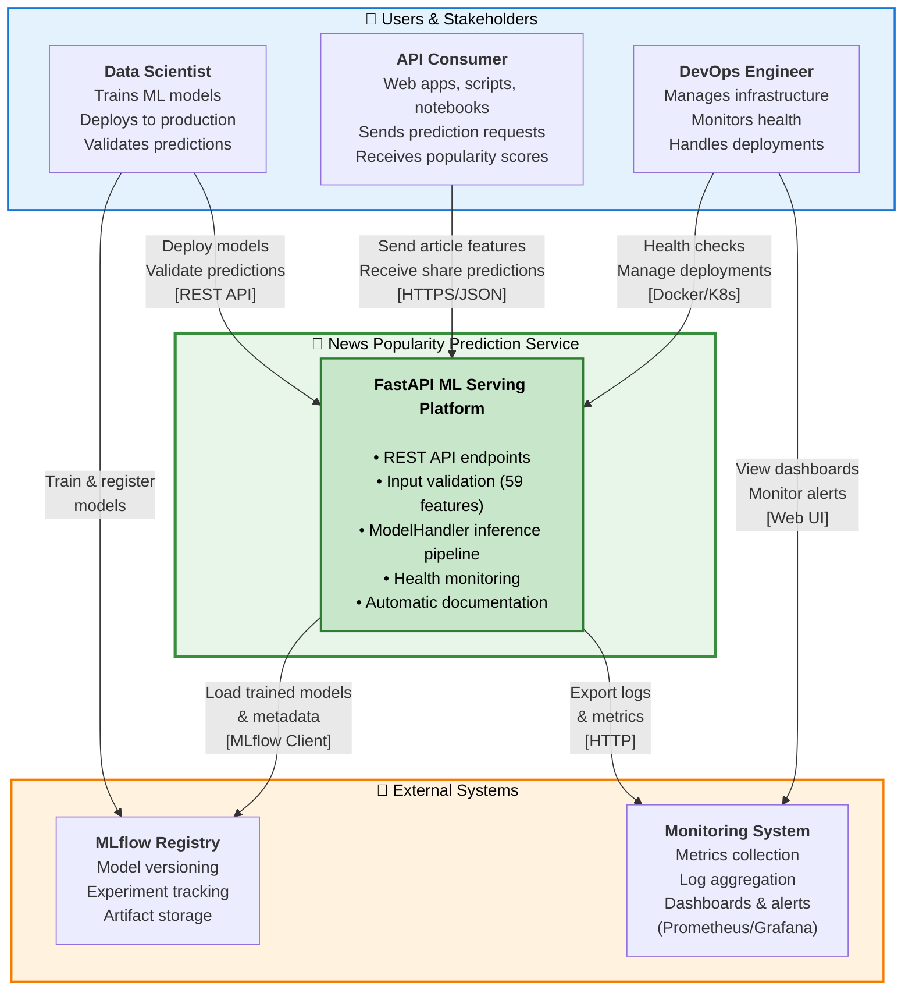
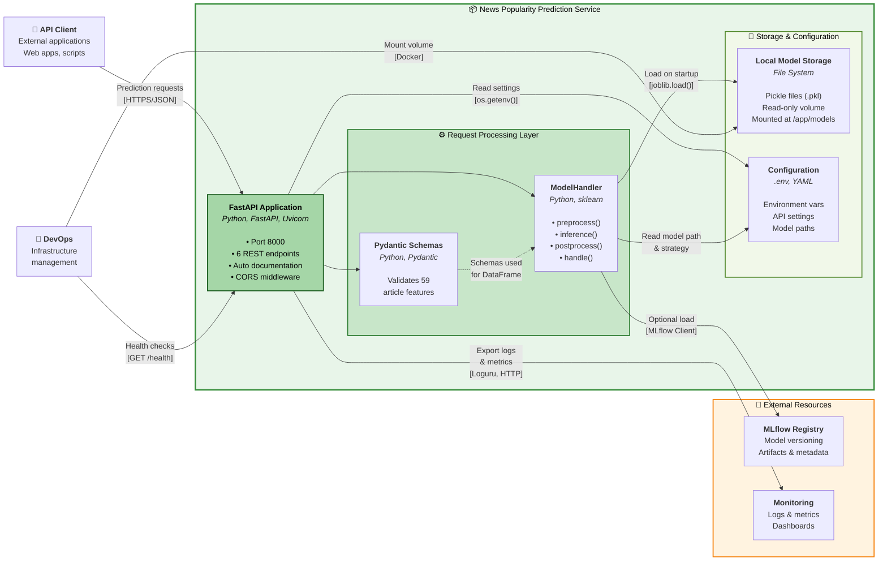
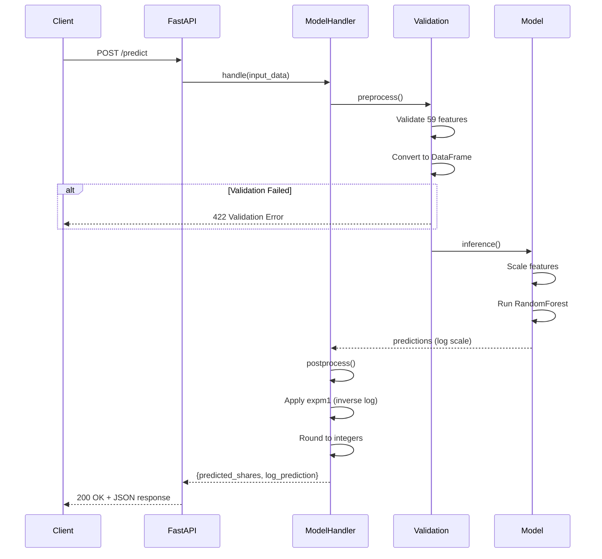
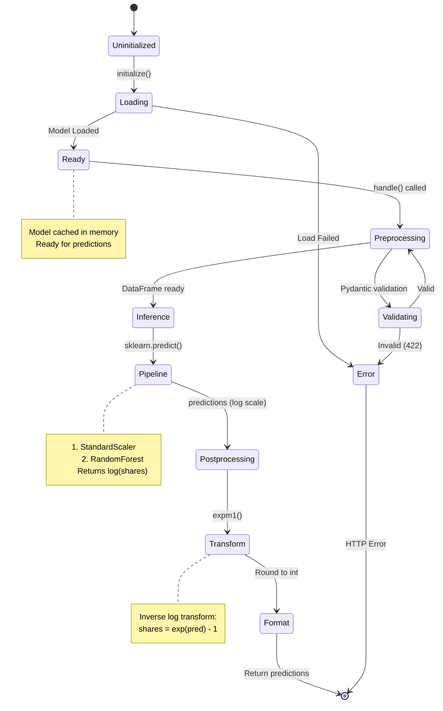
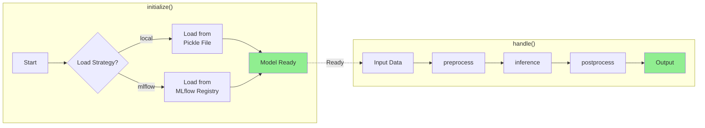

# Model Serving & Deployment

## Overview

The Online News Popularity prediction model is served via a production-ready **FastAPI** application that provides RESTful endpoints for both online (single) and batch predictions. The service is fully containerized with Docker and designed for easy deployment to various platforms.

## Architecture

### System Context: High-Level Architecture

This diagram shows the high-level view of the News Popularity Prediction System and its interactions with users and external systems.



**Key Interactions:**

- **Data Scientists** train models using the MLOps pipeline and register them in MLflow, then validate predictions through the API
- **API Consumers** (web apps, scripts, notebooks) send article features and receive popularity predictions
- **DevOps Engineers** deploy containers, monitor health endpoints, and manage infrastructure
- **MLflow Registry** provides trained models and metadata for inference
- **Monitoring System** collects operational metrics and logs (Prometheus/Grafana/CloudWatch)

---

### Container Architecture: Internal Structure

This diagram zooms into the Prediction Service to show its internal containers (applications and data stores).



**Key Containers:**

- **FastAPI Application**: Web server exposing 6 REST endpoints (`/health`, `/info`, `/predict`, `/predict/batch`, `/predict/batch/csv`, `/docs`)
- **ModelHandler**: Core inference engine implementing the prediction pipeline (preprocess → inference → postprocess)
- **Pydantic Schemas**: Data validation layer ensuring all 59 features are present and valid before inference
- **Local Model Storage**: File system volume containing trained sklearn Pipeline models (`.pkl` files)
- **Configuration**: Environment-based settings for model loading strategy, API host/port, and log levels

**Data Flow:**

1. API consumer sends prediction request to FastAPI
2. FastAPI validates input against Pydantic schemas
3. FastAPI passes validated data to ModelHandler
4. ModelHandler loads model from local storage or MLflow (on first request)
5. ModelHandler runs prediction pipeline and returns results
6. FastAPI formats response and returns to consumer

---

### Detailed Flows

The following diagrams provide deeper technical details about request processing and state management.

#### Request Flow



#### ModelHandler State Machine

This state diagram shows the complete lifecycle of the ModelHandler from initialization through prediction.



#### ModelHandler Methods

This flowchart shows the internal methods of ModelHandler and how they interact.



---

## Key Features

- **Multiple Endpoints**: Health check, model info, single prediction, batch prediction (JSON & CSV)
- **Input Validation**: Pydantic-based schema validation for all 59 features
- **Flexible Model Loading**: Load from local pickle files or MLflow registry
- **Automatic Documentation**: Interactive Swagger UI and ReDoc
- **Error Handling**: Comprehensive error messages with proper HTTP status codes
- **Logging**: Performance timing and debugging logs via loguru
- **CORS Support**: Configurable CORS middleware for web integration
- **Health Monitoring**: Built-in health check endpoint for container orchestration

## Quick Start

### Local Development

```bash
# 1. Install dependencies
pip install -r requirements.txt

# 2. Run the server (with auto-reload)
make serve

# 3. Access the API
open http://localhost:8000/docs
```

### Docker Deployment

```bash
# 1. Build the image
make docker-build

# 2. Run the container
make docker-up

# 3. View logs
make docker-logs
```

## API Endpoints

| Endpoint | Method | Description |
|----------|--------|-------------|
| `/` | GET | API information and links |
| `/health` | GET | Health check status |
| `/info` | GET | Model metadata and features |
| `/predict` | POST | Single article prediction |
| `/predict/batch` | POST | Batch prediction (JSON) |
| `/predict/batch/csv` | POST | Batch prediction (CSV upload) |
| `/docs` | GET | Swagger UI documentation |
| `/redoc` | GET | ReDoc documentation |

## Components

### ModelHandler

The `ModelHandler` class implements a pattern similar to AWS SageMaker handlers and orchestrates the complete ML prediction pipeline:

- **`initialize()`**: Loads model from MLflow registry or local pickle file on startup
- **`preprocess()`**: Validates input features and converts to DataFrame format
- **`inference()`**: Runs prediction through sklearn Pipeline (scaling + model)
- **`postprocess()`**: Applies inverse log transform and formats output as integers
- **`handle()`**: Orchestrates the complete pipeline (preprocess → inference → postprocess)

See the [Detailed Flows](#detailed-flows) section for visual diagrams of the ModelHandler state machine and methods.

### FastAPI Application

The FastAPI app (`app.py`) provides:

- RESTful endpoints with OpenAPI documentation
- Request/response validation via Pydantic
- Error handling with detailed messages
- CORS middleware for cross-origin requests
- Startup/shutdown event handlers

### Configuration

Environment-based configuration via `.env` file:

```bash
MODEL_NAME=RandomForestBase
MODEL_LOAD_STRATEGY=local  # or mlflow
MODEL_PATH=models/randomforestbase_best_20251102_165526.pkl
API_HOST=0.0.0.0
API_PORT=8000
LOG_LEVEL=INFO
```

## Performance

### Response Times (Approximate)

- **Health check**: <10ms
- **Model info**: <10ms
- **Single prediction**: 50-100ms
- **Batch (100 articles)**: 200-500ms
- **CSV upload (100 articles)**: 300-600ms

### Optimization Tips

1. Use batch endpoints for multiple predictions
2. Keep batch sizes under 500 for optimal performance
3. CSV format is slightly faster than JSON for large batches
4. Reuse HTTP connections when making multiple requests

## Testing

The serving module has comprehensive test coverage:

```bash
# Run all serving tests
make test-serving

# Run with coverage report
make test-coverage

# Run integration tests only
make test-integration
```

**Test Coverage**: 80%+ with 83 tests covering:
- Pydantic schema validation
- ModelHandler pipeline
- All API endpoints
- Error handling
- CORS and documentation

## Next Steps

- [Getting Started](getting-started.md) - Step-by-step setup guide
- [API Reference](api-reference.md) - Complete endpoint documentation
- [Deployment Guide](deployment.md) - Production deployment options
- [Testing Guide](testing.md) - How to test the API
- [Troubleshooting](troubleshooting.md) - Common issues and solutions
