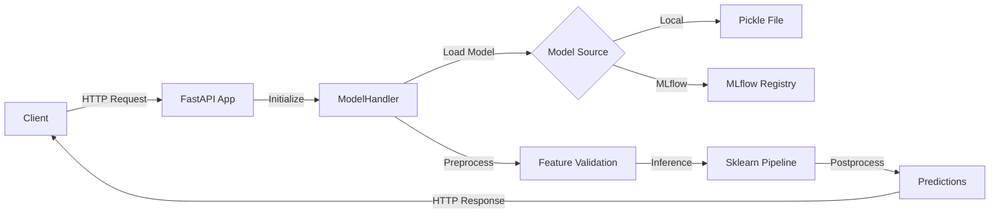

# Model Serving & Deployment

## Overview

The Online News Popularity prediction model is served via a production-ready **FastAPI** application that provides RESTful endpoints for both online (single) and batch predictions. The service is fully containerized with Docker and designed for easy deployment to various platforms.

## Architecture



## Key Features

- **Multiple Endpoints**: Health check, model info, single prediction, batch prediction (JSON & CSV)
- **Input Validation**: Pydantic-based schema validation for all 59 features
- **Flexible Model Loading**: Load from local pickle files or MLflow registry
- **Automatic Documentation**: Interactive Swagger UI and ReDoc
- **Error Handling**: Comprehensive error messages with proper HTTP status codes
- **Logging**: Performance timing and debugging logs via loguru
- **CORS Support**: Configurable CORS middleware for web integration
- **Health Monitoring**: Built-in health check endpoint for container orchestration

## Quick Start

### Local Development

```bash
# 1. Install dependencies
pip install -r requirements.txt

# 2. Run the server (with auto-reload)
make serve

# 3. Access the API
open http://localhost:8000/docs
```

### Docker Deployment

```bash
# 1. Build the image
make docker-build

# 2. Run the container
make docker-up

# 3. View logs
make docker-logs
```

## API Endpoints

| Endpoint | Method | Description |
|----------|--------|-------------|
| `/` | GET | API information and links |
| `/health` | GET | Health check status |
| `/info` | GET | Model metadata and features |
| `/predict` | POST | Single article prediction |
| `/predict/batch` | POST | Batch prediction (JSON) |
| `/predict/batch/csv` | POST | Batch prediction (CSV upload) |
| `/docs` | GET | Swagger UI documentation |
| `/redoc` | GET | ReDoc documentation |

## Components

### ModelHandler

The `ModelHandler` class implements a pattern similar to AWS SageMaker handlers:

- **`initialize()`**: Loads model from MLflow or local file
- **`preprocess()`**: Validates input and formats for inference
- **`inference()`**: Runs prediction through sklearn Pipeline
- **`postprocess()`**: Applies inverse log transform and formats output
- **`handle()`**: Complete pipeline orchestration

### FastAPI Application

The FastAPI app (`app.py`) provides:

- RESTful endpoints with OpenAPI documentation
- Request/response validation via Pydantic
- Error handling with detailed messages
- CORS middleware for cross-origin requests
- Startup/shutdown event handlers

### Configuration

Environment-based configuration via `.env` file:

```bash
MODEL_NAME=RandomForestBase
MODEL_LOAD_STRATEGY=local  # or mlflow
MODEL_PATH=models/randomforestbase_best_20251102_165526.pkl
API_HOST=0.0.0.0
API_PORT=8000
LOG_LEVEL=INFO
```

## Performance

### Response Times (Approximate)

- **Health check**: <10ms
- **Model info**: <10ms
- **Single prediction**: 50-100ms
- **Batch (100 articles)**: 200-500ms
- **CSV upload (100 articles)**: 300-600ms

### Optimization Tips

1. Use batch endpoints for multiple predictions
2. Keep batch sizes under 500 for optimal performance
3. CSV format is slightly faster than JSON for large batches
4. Reuse HTTP connections when making multiple requests

## Testing

The serving module has comprehensive test coverage:

```bash
# Run all serving tests
make test-serving

# Run with coverage report
make test-coverage

# Run integration tests only
make test-integration
```

**Test Coverage**: 80%+ with 83 tests covering:
- Pydantic schema validation
- ModelHandler pipeline
- All API endpoints
- Error handling
- CORS and documentation

## Next Steps

- [Getting Started](getting-started.md) - Step-by-step setup guide
- [API Reference](api-reference.md) - Complete endpoint documentation
- [Deployment Guide](deployment.md) - Production deployment options
- [Testing Guide](testing.md) - How to test the API
- [Troubleshooting](troubleshooting.md) - Common issues and solutions
