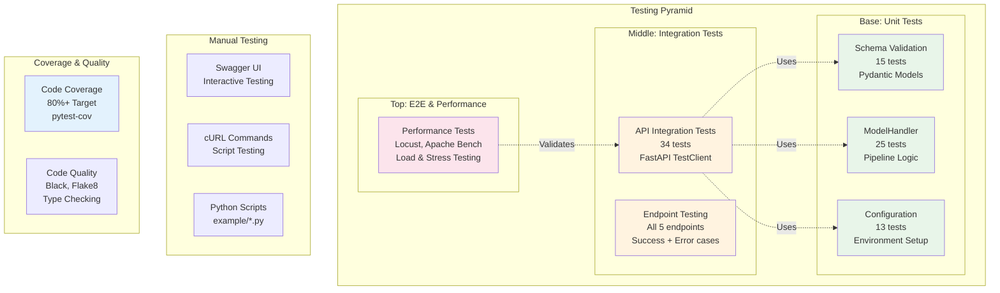
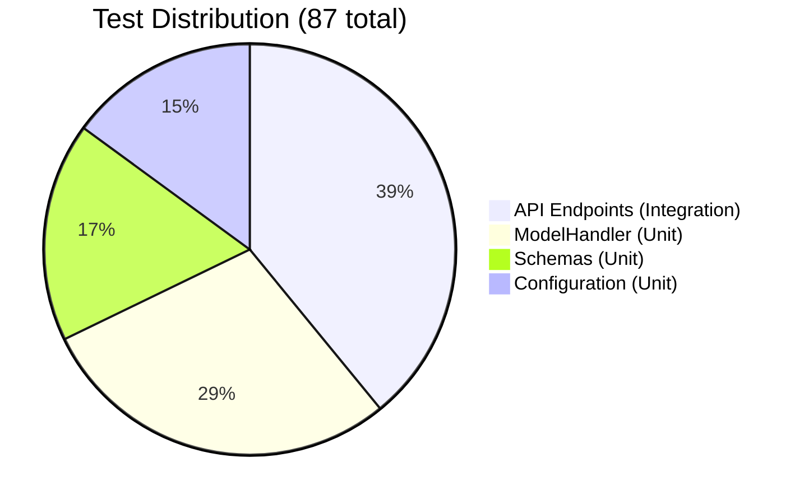

# Testing the API

This guide covers testing the model serving API at different levels: manual testing, automated tests, and performance testing.

## Testing Strategy Overview



### Test Coverage Summary

**Total**: 87 automated tests

| Category | Tests | Coverage | Files |
|----------|-------|----------|-------|
| **Unit Tests** | 53 | 99%+ | schemas, config, model_handler |
| **Integration Tests** | 34 | 80%+ | API endpoints, CORS, docs |
| **Performance Tests** | Manual | N/A | Locust, Apache Bench |

#### Breakdown by Module



## Manual Testing

### Using Swagger UI

The easiest way to test the API is through the interactive Swagger UI:

1. Start the server:
   ```bash
   make serve
   ```

2. Open Swagger UI: [http://localhost:8000/docs](http://localhost:8000/docs)

3. Click on any endpoint to expand it

4. Click "Try it out"

5. Modify the request body if needed

6. Click "Execute"

7. View the response

### Using cURL

#### Health Check

```bash
curl http://localhost:8000/health
```

#### Model Info

```bash
curl http://localhost:8000/info
```

#### Single Prediction

```bash
curl -X POST http://localhost:8000/predict \
  -H "Content-Type: application/json" \
  -d '{
    "n_tokens_title": 10.0,
    "n_tokens_content": 500.0,
    ... (all 59 features)
  }'
```

Or use the sample file:

```bash
curl -X POST http://localhost:8000/predict \
  -H "Content-Type: application/json" \
  -d @examples/sample_input.json
```

#### Batch Prediction

```bash
curl -X POST http://localhost:8000/predict/batch \
  -H "Content-Type: application/json" \
  -d @examples/sample_batch.json
```

#### CSV Upload

```bash
curl -X POST http://localhost:8000/predict/batch/csv \
  -F "file=@examples/sample_data.csv"
```

### Using Python Requests

```python
import requests
import json

# Base URL
BASE_URL = "http://localhost:8000"

# Test health
response = requests.get(f"{BASE_URL}/health")
print(f"Health: {response.json()}")

# Test single prediction
with open("examples/sample_input.json") as f:
    features = json.load(f)

response = requests.post(f"{BASE_URL}/predict", json=features)
result = response.json()
print(f"Predicted shares: {result['predicted_shares']:,}")
```

### Using Test Scripts

We provide ready-to-use test scripts:

```bash
# Test all endpoints
python examples/test_predict_single.py
python examples/test_predict_batch.py
python examples/test_predict_csv.py

# Or use Makefile shortcuts
make test-api
make test-api-batch
make test-api-csv
```

## Automated Testing

### Running the Test Suite

The project includes a comprehensive test suite with **83 tests** covering all functionality.

#### Run All Tests

```bash
make test
```

#### Run Serving Tests Only

```bash
make test-serving
```

#### Run with Coverage

```bash
make test-coverage
```

This generates:
- Terminal coverage report
- HTML report in `htmlcov/` directory
- XML report for CI/CD

#### Run Specific Test Categories

```bash
# Unit tests only
make test-unit

# Integration tests only
make test-integration

# Specific test file
pytest tests/test_serving/test_api.py

# Specific test function
pytest tests/test_serving/test_api.py::TestPredictEndpoint::test_predict_success
```

### Test Categories

The test suite is organized into:

#### Unit Tests

Test individual components in isolation:

- **`test_schemas.py`**: Pydantic validation (15 tests)
  - Valid/invalid inputs
  - Missing features
  - Type validation
  - Batch size limits

- **`test_config.py`**: Configuration loading (13 tests)
  - Default values
  - Environment overrides
  - Feature list validation

- **`test_model_handler.py`**: ModelHandler class (25 tests)
  - Model loading (local & MLflow)
  - Preprocessing pipeline
  - Inference
  - Postprocessing
  - Complete pipeline

#### Integration Tests

Test API endpoints end-to-end:

- **`test_api.py`**: FastAPI endpoints (30+ tests)
  - All endpoints (health, info, predict, batch, CSV)
  - Success cases
  - Error handling
  - Validation errors
  - CORS
  - API documentation

### Understanding Test Output

#### Successful Test Run

```
tests/test_serving/test_api.py::TestHealthEndpoint::test_health_endpoint PASSED
tests/test_serving/test_schemas.py::TestNewsArticleFeatures::test_valid_features PASSED
...
=================== 83 passed in 12.34s ===================
```

#### Failed Test

```
FAILED tests/test_serving/test_api.py::TestPredictEndpoint::test_predict_success
__________ TestPredictEndpoint.test_predict_success __________
    def test_predict_success(self):
>       assert response.status_code == 200
E       assert 500 == 200
```

#### Coverage Report

```
Name                                          Stmts   Miss  Cover
-----------------------------------------------------------------
mlops_online_news_popularity/serving/__init__.py      3      0   100%
mlops_online_news_popularity/serving/app.py         145     12    92%
mlops_online_news_popularity/serving/config.py       25      2    92%
mlops_online_news_popularity/serving/model_handler.py 98      8    92%
mlops_online_news_popularity/serving/schemas.py      72      4    94%
-----------------------------------------------------------------
TOTAL                                                343     26    92%
```

### Writing Custom Tests

#### Test Structure

```python
# tests/test_serving/test_custom.py
import pytest
from fastapi.testclient import TestClient

@pytest.mark.integration
def test_custom_scenario(initialized_test_client, sample_features):
    """Test a custom scenario."""
    # Arrange
    features = sample_features.copy()
    features["n_tokens_title"] = 20.0

    # Act
    response = initialized_test_client.post("/predict", json=features)

    # Assert
    assert response.status_code == 200
    result = response.json()
    assert result["predicted_shares"] > 0
```

#### Using Fixtures

Available fixtures (defined in `conftest.py`):

- `sample_features`: Dict with all 59 features
- `mock_sklearn_pipeline`: Mock model for testing
- `temp_model_file`: Temporary model file
- `test_client`: FastAPI TestClient (no model loaded)
- `initialized_test_client`: TestClient with loaded model
- `sample_csv_content`: Sample CSV bytes

#### Test Markers

Use markers to categorize tests:

```python
@pytest.mark.unit
def test_unit_functionality():
    pass

@pytest.mark.integration
def test_api_endpoint():
    pass

@pytest.mark.slow
def test_performance():
    pass

@pytest.mark.serving
def test_serving_specific():
    pass
```

Run specific markers:

```bash
pytest -m unit
pytest -m "not slow"
```

## Performance Testing

### Load Testing with Locust

Create `locustfile.py`:

```python
from locust import HttpUser, task, between
import json

class APIUser(HttpUser):
    wait_time = between(1, 3)

    def on_start(self):
        with open("examples/sample_input.json") as f:
            self.features = json.load(f)

    @task(3)
    def predict_single(self):
        self.client.post("/predict", json=self.features)

    @task(1)
    def health_check(self):
        self.client.get("/health")
```

Run:

```bash
pip install locust
locust -f locustfile.py --host http://localhost:8000
```

Open [http://localhost:8089](http://localhost:8089) and configure:
- Number of users: 100
- Spawn rate: 10 users/second

### Benchmarking with Apache Bench

```bash
# Install apache2-utils
sudo apt-get install apache2-utils  # Ubuntu
brew install httpd  # macOS

# Benchmark health endpoint
ab -n 1000 -c 10 http://localhost:8000/health

# Benchmark with POST request
ab -n 100 -c 5 -p examples/sample_input.json \
   -T application/json \
   http://localhost:8000/predict
```

### Expected Performance

On a standard laptop (4 cores, 8GB RAM):

| Endpoint | Response Time (p95) | Throughput |
|----------|---------------------|------------|
| `/health` | <10ms | 1000+ req/s |
| `/info` | <20ms | 500+ req/s |
| `/predict` | 50-100ms | 100-200 req/s |
| `/predict/batch` (100) | 200-500ms | 20-50 req/s |

## Continuous Integration

### GitHub Actions

Create `.github/workflows/test-serving.yml`:

```yaml
name: Test Serving API

on: [push, pull_request]

jobs:
  test:
    runs-on: ubuntu-latest

    steps:
      - uses: actions/checkout@v3

      - name: Set up Python
        uses: actions/setup-python@v4
        with:
          python-version: '3.10'

      - name: Install dependencies
        run: |
          pip install -e .
          pip install -r requirements.txt

      - name: Run tests
        run: make test-serving

      - name: Generate coverage report
        run: make test-coverage

      - name: Upload coverage to Codecov
        uses: codecov/codecov-action@v3
        with:
          file: ./coverage.xml
```

## Troubleshooting Tests

### Test Failures

**Model Not Found**:
```
FileNotFoundError: Model file not found
```
Solution: Tests use mock models. Check fixture setup in `conftest.py`.

**Import Errors**:
```
ModuleNotFoundError: No module named 'mlops_online_news_popularity'
```
Solution: Install package in development mode:
```bash
pip install -e .
```

**Port Already in Use**:
```
OSError: [Errno 48] Address already in use
```
Solution: Stop the development server before running tests.

### Slow Tests

If tests are slow:

```bash
# Run tests in parallel (requires pytest-xdist)
pip install pytest-xdist
pytest -n auto
```

### Debugging Failed Tests

```bash
# Run with verbose output
pytest -vv

# Stop on first failure
pytest -x

# Enter debugger on failure
pytest --pdb

# Show print statements
pytest -s
```

## Best Practices

1. **Always run tests before committing**
   ```bash
   make test-serving
   ```

2. **Check coverage regularly**
   ```bash
   make test-coverage
   ```

3. **Test error cases, not just happy paths**

4. **Use fixtures for reusable test data**

5. **Mark slow tests** so they can be skipped during development:
   ```python
   @pytest.mark.slow
   def test_expensive_operation():
       pass
   ```

6. **Mock external dependencies** (models, databases, APIs)

7. **Keep tests fast** - unit tests should run in < 1 second

8. **Write descriptive test names**:
   ```python
   def test_predict_returns_positive_shares_for_valid_input():
       pass
   ```

## Next Steps

- [Troubleshooting](troubleshooting.md) - Common issues and solutions
- [Deployment](deployment.md) - Deploy to production
- [API Reference](api-reference.md) - Complete endpoint documentation
